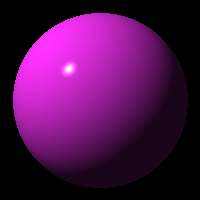

# ray-tracer-challenge-scala

Implementing "The Ray Tracer Challenge," by Jamis Buck, in Scala. This is to both
provide a project I can share with those at work when I present on functional
programming, as well as increase my own knowledge of Scala and functional programming
generally.

### Usage

This is a normal sbt project. You can compile code with `sbt compile`, run it with `sbt run`, and `sbt console` will start a Scala 3 REPL.

Upon running, will output `output.ppm`. This can be opened with the GIMP.

### Sample Output

Sample output (converted to PNG for display):

